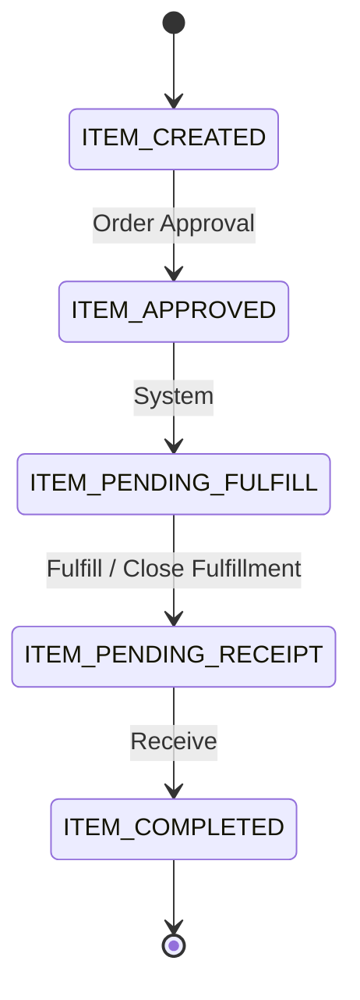
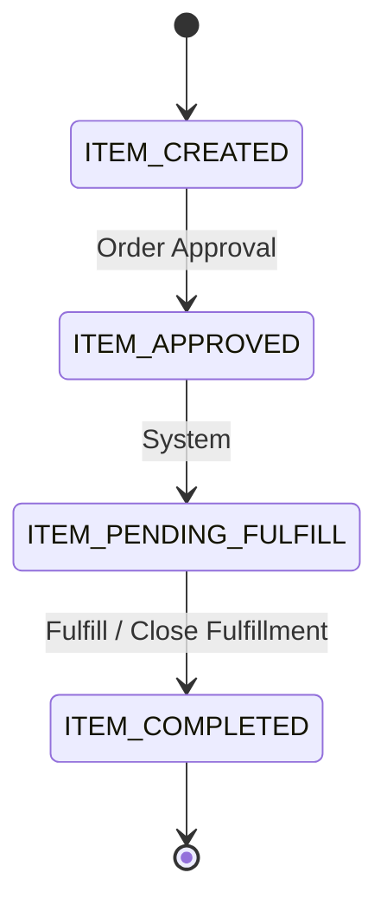
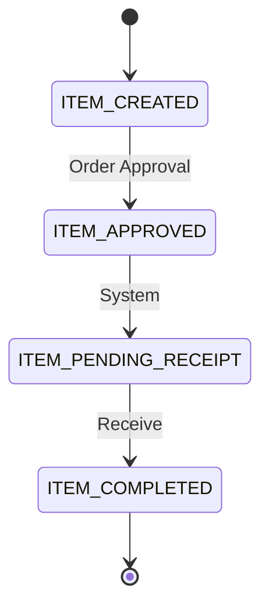

# Order Action Logic Documentation

This document outlines the business rules and logic for determining the next valid actions for a transfer order based on its status, item states, and fulfillment flow.

## Definitions

### Order Statuses
- **Created**: Initial state of the order.
- **Approved**: Order is validated and ready for the next lifecycle step (fulfillment/receipt).
- **Cancelled**: Order is terminated and no further actions are allowed.
- **Completed**: Order has reached the end of its lifecycle.

### Order Status Flow Types
- **Fulfill and Receive (`TO_Fulfill_And_Receive`)**: Requires both origin fulfillment (shipping) and destination receipt.
- **Fulfill Only (`TO_Fulfill_Only`)**: The lifecycle ends once the order is shipped from the origin.
- **Receive Only (`TO_Receive_Only`)**: The lifecycle starts with the assumption of shipment or direct receipt at the destination.

## Status Transitions

### Header Level Transitions

```mermaid
stateDiagram-v2
    [*] --> ORDER_CREATED: Create Order
    ORDER_CREATED --> ORDER_APPROVED: Approve
    ORDER_CREATED --> ORDER_CANCELLED: Cancel
    
    state "ORDER_APPROVED" as Approved {
        state "Check Impact" as CI <<choice>>
        [*] --> CI
        CI --> ORDER_CANCELLED: No Inventory Impact
        CI --> ORDER_COMPLETED: Inventory Impacted (System)
    }

    note right of CI
        <b>TO_Fulfill_And_Receive / TO_Fulfill_Only:</b>
        Check for Outbound Shipments (Packed/Shipped)
        
        <b>TO_Receive_Only:</b>
        Check for Item Receipts
    end note

    ORDER_CANCELLED --> [*]
    ORDER_COMPLETED --> [*]
```

### Item Level Transitions by Flow

#### 1. Fulfill and Receive (`TO_Fulfill_And_Receive`)

#### 2. Fulfill Only (`TO_Fulfill_Only`)

#### 3. Receive Only (`TO_Receive_Only`)

## Business Rules

### Cancellation Eligibility
The primary rule is: **If inventory has been impacted by the order, it cannot be cancelled at the header level and must move to a completed status.**

#### Header-Level Cancellation
1.  **Fulfill & Receive / Fulfill Only Flows**: Eligible for cancellation **ONLY if no outbound shipment has been created** (specifically in `Packed` or `Shipped` status) against the order. Once inventory is issued/packed, header-level cancellation is blocked.
2.  **Receive Only Flow**: Eligible for cancellation **ONLY if no item receipts have been recorded** against the order.

#### Item-Level Actions (Partial Shipments & Fulfillment)
When an item has been **partially shipped**, you cannot "Cancel" the item in the traditional sense (status -> `ITEM_CANCELLED`). Instead, you **close the fulfillment**.

- **Fulfill and Receive Flow**:
  - Closing fulfillment calculates the `remainingQuantity` (Ordered - Shipped) and sets it as `cancelQuantity`.
  - The item status **moves to `ITEM_PENDING_RECEIPT`**.
  - This informs the system that no more units will be shipped, but the units already shipped must still be received at the destination.
- **Fulfill Only Flow**:
  - Closing fulfillment cancels the remainder and **moves the item to `ITEM_COMPLETED`**.
- **Impact**: All inventory reservations for the unfulfilled portion are released.

### Approval Logic
- Approval is only available when the order is in the **Created** status.

## Action Mapping Table

### Header-Level Actions
These actions appear in the **Order Header** (end slot buttons).

| Order Status | Conditions | Available Actions | Rationale |
| :--- | :--- | :--- | :--- |
| **Created** | - | **Approve**, **Cancel** | Standard initial state. |
| **Approved** | **Inventory Impacted** (Shipments exist OR Receipts exist) | (None) | Header cancellation blocked; order must move to Completed. |
| **Approved** | **No Inventory Impact** | **Cancel** | Safe to cancel as no inventory movement has started. |
| **Cancelled / Completed** | - | (None) | Final states. |

### Item-Level Actions
These actions appear in the **Order Item list** (popover/row actions).

| Order Status | Item Status | Available Actions | Rationale |
| :--- | :--- | :--- | :--- |
| **Created** | **ITEM_CREATED** | **Edit Qty**, **Remove** | Adjustments allowed before approval. |
| **Approved** | **ITEM_CREATED** | **Approve**, **Cancel** | Newly added items must be approved or removed. |
| **Approved** | **ITEM_APPROVED / ITEM_PENDING_FULFILL** | **Fulfill**, **Close Fulfillment** | Ready to ship or stop further shipping (cancels remainder). |
| **Approved** | **ITEM_PENDING_RECEIPT** | **Receive** | Fulfillment phase is over; must be received (even with 0 qty). |

---

> [!IMPORTANT]
> **Technical Check for Cancellation**:
> - **Outbound Shipments**: Check if `currentOrder.shipments` contains any item with `shipmentTypeId === 'OUT_TRANSFER'` and `statusId` is `SHIPMENT_PACKED` or `SHIPMENT_SHIPPED`.
> - **Item Receipts**: Check if any order item has `itemReceipts` or if `totalReceivedQuantity > 0`.
